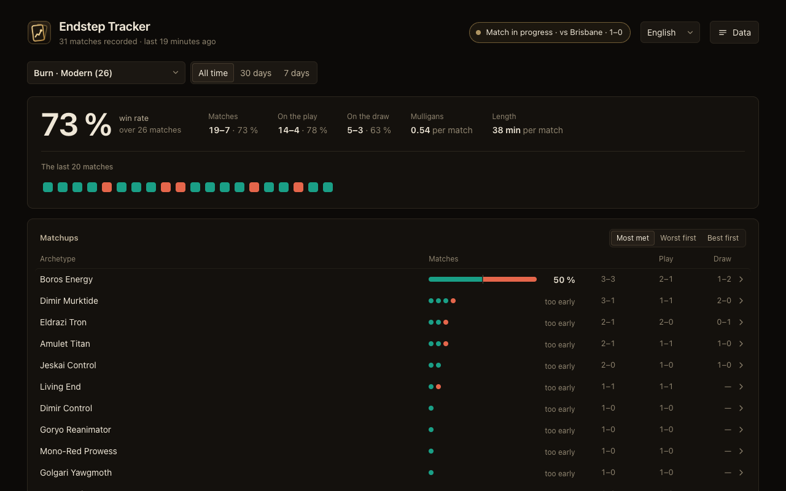

# Endstep Tracker

A browser extension that records the Magic: The Gathering matches you play on [endstep.cc](https://endstep.cc), automatically, and turns them into win rates by deck and by matchup. Nothing to type, no account, everything stays in your browser.

## Install

[Chrome Web Store](https://chromewebstore.google.com/detail/endstep-tracker/ioeffckengdfapnapdbphkbnnnnaajho) (also Brave, Opera) · [Firefox](https://addons.mozilla.org/en-US/firefox/addon/endstep-tracker/) · [Edge](https://microsoftedge.microsoft.com/addons/detail/endstep-tracker/oloikebkijkmhlodohfbjbekkmghblbp) · [Safari on Mac](https://apps.apple.com/us/app/endstep-tracker/id6816954721?mt=12)

Desktop browsers only: Chrome on Android has no extensions.

## Features

- **Every match recorded**: format, Bo1/Bo3, score, play/draw, mulligans, opening hand, turns, life totals, length, full game log.
- **The opponent's archetype**, recognized from the cards you saw against endstep's own metagame (Pauper, Modern, Premodern, Legacy, Vintage), named after the commander in Duel Commander, and correctable by hand.
- **Win rates** by deck and by matchup, on the play and on the draw, per version of your list.
- **My cards**: for each card, your win rate in the games where you drew it, where you didn't, and when it was in your opening hand.
- **Your sideboarding**, recorded between games: your usual plan against each archetype.
- **A small panel on endstep.cc**: your record in the matchup, your usual sideboarding between games, opponents you met before.
- **Your past matches**, imported from your endstep history when you ask for it.
- CSV and JSON export, backups, English and French.

## Privacy

Everything is stored locally (`chrome.storage.local`). There is no server and no analytics. The only network requests are endstep's public metagame API (archetype recognition), Scryfall card images when you hover a card in the dashboard, and your own endstep history pages when you import them. The extension never plays or clicks for you. Details in [PRIVACY.md](PRIVACY.md).

## How it works

Plain JavaScript, Manifest V3, no dependencies and no build step: the code in this repository is the code that runs.

| File | Role |
|---|---|
| `hook.js` | In the page: mirrors the game messages endstep already sends to the browser (read-only) |
| `content.js`, `tracker.js` | Turn those messages into match records and store them |
| `overlay.js` | The panel on endstep.cc (closed shadow root, never takes the keyboard from the game) |
| `dashboard.*`, `popup.*` | The dashboard and the toolbar popup |
| `shared.js`, `meta.js` | Records, archetype recognition, endstep's metagame |
| `background.js` | Badge, and re-attaching open endstep.cc tabs after an update |

## Development

1. `chrome://extensions`, turn on Developer mode, **Load unpacked**, pick this folder.
2. Reload the endstep.cc tabs that were already open.
3. Tests: `for t in test/*.test.js; do node "$t" || break; done`

Releases follow `store/STORE.md`; changes are listed in [CHANGELOG.md](CHANGELOG.md) (in French), and the detailed notes on internals, tests and publishing are in [docs/DEVELOPMENT.md](docs/DEVELOPMENT.md) (in French).

## License and support

[MIT](LICENSE). A fan project, not affiliated with endstep. If it helps you, you can [buy me a coffee](https://buymeacoffee.com/mcouzinet).
